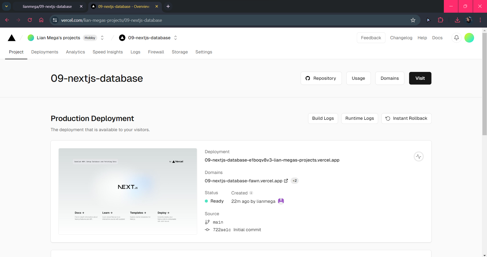

### Nama : Lian Mega Pratiwi
### NIM : 2041720257
### Kelas : TI-3A
---

# Praktikum 1: Setup Database
## Soal 1
#### Capture hasil deploy project Anda dan buatlah laporan di file README.md. Jelaskan apa yang telah Anda pelajari?

()

Menggunakan Vercel sebagai layanan deployment untuk aplikasi web, termasuk pengaturan awal dan proses deploy

## Soal 2
Menginstal paket @vercel/postgres dan menyimpannya sebagai dependensi dalam file package.json proyek